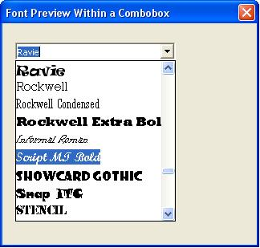



## Owner\-Drawn ComboBox

### Description

Subclass an ImageCombo control to create an owner-drawn combobox that functions like Excel's font preview ComboBox. Also includes a callback function to enumerate available fonts.
 
### More Info
 

             |
---                |---
**Submitted On**   |2007-05-27 10:35:14
**By**             |[Andrew Tonkovich](https://github.com/Planet-Source-Code/PSCIndex/blob/master/ByAuthor/andrew-tonkovich.md)
**Level**          |Intermediate
**User Rating**    |5.0 (10 globes from 2 users)
**Compatibility**  |VBA MS Excel
**Category**       |[Microsoft Office Apps/VBA](https://github.com/Planet-Source-Code/PSCIndex/blob/master/ByCategory/microsoft-office-apps-vba__1-42.md)
**World**          |[Visual Basic](https://github.com/Planet-Source-Code/PSCIndex/blob/master/ByWorld/visual-basic.md)
**Archive File**   |[Owner\-Draw2067685272007\.zip](https://github.com/Planet-Source-Code/andrew-tonkovich-owner-drawn-combobox__1-68681/archive/master.zip)

